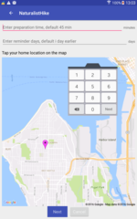
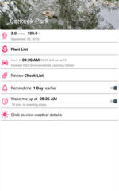
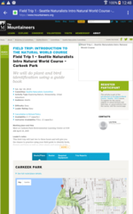
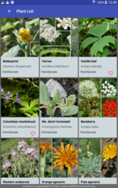
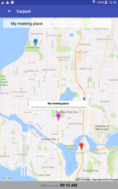
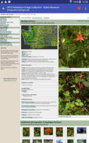
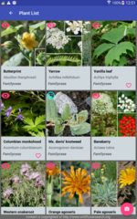
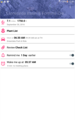
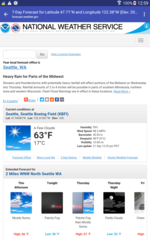
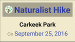

# Android Projects for [Udacity Android Developer](https://www.udacity.com/course/android-developer-nanodegree-by-google--nd801)
Built mobile apps  
* [Naturalist Hike Assistant](#capstone) (My Capstone Project)
* [Weather 4 WatchFace](#watchface) (App for Android Watch Face)
* [XZY Reader](#xyzreader) (Material Design)
* [Build It Bigger](#builditbig) (How to Commerialize App)
* [Stock Hawk](#stockhawk) (Turn a Crashing App into a Product)
* [Movie Fun](#movieapp) (App for Android Phone and Tablet) 

### [Naturalist Hikers Assistant](https://github.com/mingrutar/Capstone-Project)
<b>Naturalist Hikers Assistant</b> helps hikers prepare for the hike, assists hikers during hiking and helps hikers reviewing their observation. However, the capstone project focuses on pre-trip preparation. See details of capstone project in the document.

|  |  |  |  |  |
|:-----|:-----|:-----|:-----|:-----|
|  |  |  |  |  |
| Setup my location | The home page  shows the upcoming trip | The trip details | The plants I am interested to see at this trip | The meet up places |
|  |  |  | |  |
| A detail description  about a plant | During the hike, I  can mark the plant  when I saw it and take  photos if I like | The list of future trips | The weather report of the hiking day | App widget |

### [Weather 4 WatchFace](https://github.com/mingrutar/WatchFace)
Android watch face app that shows weather info. The watch face couples with Sunshine phone app. Features:
* The background color of watch face could be changed at app. 
* The temperature could be displayed in metric or imperial. 
* The Sunshine app fetches weather info periodically and update the watch after sync. 
* The display of watch face has normal, ambient and low-energy modes, see screenshots. 
* Tapping watch face 2 times launches Sunshine app at phone.
|  |  |  |  |  |
|:-----|:-----|:-----|:-----|:-----|

### [XYZ Reader](https://github.com/mingrutar/MyXYZReader)
Redesign the app UI to comply with material design. The comparison of before and after redesign (not able to show the added material design style animations)

### [Build It Bigger](https://github.com/mingrutar/BuildItBigger)
Learn how to commercialize via Android app:
* Free and paid versions
* Google banner image ads and interstitial image ads

The app fetches a joke from GCE, which randomly selects a joke from a joke list. If the app failed to obtain a joke from GCE, it asks a joke from a java library included in the project.

## [Stock Hawk](https://github.com/mingrutar/stockHawk)
The project starts with base code that is not production ready: limited function, occasional crash, etc. Improvements:
* Added a detail fragment that contains stock history in a graphic plot. The detail fragment is attached on top of main activity.
* The fab button alternate between add, for adding stock, and collapsing for remove detail fragment.
* Added collapsible toolbar with an image beautifies the app.
* The UI design follows material design principles.
* Added widget.
* Added Right to Left capability for internationalization
* Improved accessibility.
* Redesign all UI, including logo and widget.
* Fixed bugs and tighten up the app for production

Screen comparison of before and after:
|  |  |  |  |  |
|:-----|:-----|:-----|:-----|:-----|

## [Movie Fun](https://github.com/mingrutar/movieApp)
Created the app from scratch. Utilize Android components: RecyclerView, ContentProvider, SyncAdapter and more. Support various android device screen sizes and orientations.  

### Screenshots ###

__Tablet (two pane) Landscape and Portrait__

__Phone Portrait__

__Phone Landscape__

